# Link-First Processing Architecture - Complete Technical Specification

**Version:** 1.0  
**Date:** November 22, 2025  
**Status:** Design Complete - Ready for Implementation  
**Feature:** Save Location by Link (Google Maps URLs)

---

## Table of Contents

1. [Executive Summary](#executive-summary)
2. [Problem Statement](#problem-statement)
3. [Solution Architecture](#solution-architecture)
4. [Data Flow](#data-flow)
5. [Component Specifications](#component-specifications)
6. [Data Models](#data-models)
7. [Implementation Plan](#implementation-plan)
8. [Testing Strategy](#testing-strategy)
9. [Appendix](#appendix)

---

## 1. Executive Summary

### Current State

The Travel Companion extension currently requires users to **select text** before right-clicking to save a location. When users encounter Google Maps links on web pages, they must:
1. Select the link text manually
2. Right-click and save
3. The system treats the link as text, not as a direct location reference

This results in:
- ❌ Right-clicking directly on links doesn't work (no text selection)
- ❌ Google Maps URLs in text are processed as text strings, not parsed
- ❌ Duplicate locations when both link and text mention exist
- ❌ Lower accuracy when authoritative Place ID is available in URL

### Proposed Solution

Implement a **Link-First Dual-Path Processing Architecture** that:
- ✅ Captures `linkUrl` from Chrome context menu
- ✅ Parses Google Maps URLs to extract Place IDs, coordinates, or queries
- ✅ Processes links and text in parallel (sequential execution)
- ✅ Reconciles results by Place ID to eliminate duplicates
- ✅ Prioritizes link-sourced data (higher confidence)
- ✅ Future-proofs for other map providers (Apple Maps, TripAdvisor, etc.)

### Success Metrics

- **User Experience**: Right-click on any Google Maps link → Location saved automatically
- **Accuracy**: >95% Place ID extraction from standard Google Maps URLs
- **Deduplication**: 100% duplicate prevention when link + text reference same place
- **Performance**: <500ms overhead for link parsing (non-blocking)
- **Cost**: Minimal increase (<$0.001/save for URL expansion)

---

## 2. Problem Statement

### Use Cases

#### Use Case 1: Direct Link Save
**Scenario**: User browses a travel blog with embedded Google Maps links

```
Blog Content:
"Visit Tsingtao Brewery: https://goo.gl/maps/abc123"

User Action:
- Right-clicks on link (no text selection)
- Selects "Save Location"

Current Behavior:
- Extension fails (requires selectionText)
- User must manually select text first

Desired Behavior:
- Extension captures linkUrl
- Parses shortened URL → Full Google Maps URL
- Extracts Place ID
- Saves location with verified Google data
```

#### Use Case 2: Mixed Content (Link + Text)
**Scenario**: User selects paragraph containing both text and links

```
Selected Content:
"Loved Senso-ji Temple! It's a must-visit. https://maps.google.com/maps/place/Senso-ji+Temple/@35.7148,139.7967"

User Action:
- Selects all text (Ctrl+A or manual selection)
- Right-clicks and saves

Current Behavior:
- System processes entire string as text
- AI extracts "Senso-ji Temple" from text
- URL is treated as gibberish, pollutes context window
- Searches Google Places → Finds Place ID ChIJ123
- Creates 1 location (but inefficiently)

Desired Behavior:
- Link Parser extracts URL → Place ID ChIJ123 (confidence 1.0)
- Text Parser processes cleaned text "Loved Senso-ji Temple! It's a must-visit." → Place ID ChIJ123 (confidence 0.85)
- Reconciliation: Same Place ID → Keep link result (higher confidence)
- Creates 1 location (efficiently, with authoritative data)
```

#### Use Case 3: Broken or Incomplete Links
**Scenario**: User encounters malformed URLs

```
Content:
"Check out this place: maps.google.com/maps/place/..."

Current Behavior:
- Treated as text, parsing likely fails

Desired Behavior:
- Link Parser attempts to parse → Fails gracefully
- Falls back to text processing
- AI extracts location from surrounding context
- Still creates location (degraded but functional)
```

### Why This Matters

**Accuracy**: Place IDs are Google's authoritative identifiers. A URL with a Place ID is 100% reliable, whereas text extraction has ~85% accuracy.

**User Experience**: Right-clicking on links is intuitive. Requiring text selection adds friction.

**Deduplication**: When same location appears as both link and text, we currently risk creating duplicates or wasting AI tokens processing redundant data.

**Cost**: Parsing a URL is free. AI vision analysis costs $0.002-0.005 per request. Direct Place ID lookup is cheaper than multi-attempt text searches.

---

## 3. Solution Architecture

### High-Level Design

```
┌─────────────────────────────────────────────────────────────┐
│                    CHROME EXTENSION                          │
│  ┌────────────────────────────────────────────────────────┐ │
│  │  Context Menu Handler                                   │ │
│  │  - Captures: selectionText, linkUrl                    │ │
│  │  - Takes screenshot (may fail gracefully)              │ │
│  │  - Sends to API                                        │ │
│  └────────────────────────────────────────────────────────┘ │
└─────────────────────────────────────────────────────────────┘
                           │
                           ▼
┌─────────────────────────────────────────────────────────────┐
│                    BACKEND API                               │
│  ┌────────────────────────────────────────────────────────┐ │
│  │  POST /api/locations                                    │ │
│  │  - Validates input (including linkUrl)                 │ │
│  │  - Creates placeholder in Supabase                     │ │
│  │  - Triggers Inngest event                              │ │
│  └────────────────────────────────────────────────────────┘ │
└─────────────────────────────────────────────────────────────┘
                           │
                           ▼
┌─────────────────────────────────────────────────────────────┐
│                    INNGEST JOB                               │
│                                                              │
│  ┌──────────────────────────────────────────────────────┐  │
│  │  STEP 0: Link Pre-Parsing (NEW)                      │  │
│  │  - Extract URLs from selectedText                    │  │
│  │  - Categorize: Google Maps, other, generic          │  │
│  │  - Clean text (remove URLs)                          │  │
│  └──────────────────────────────────────────────────────┘  │
│                           │                                  │
│  ┌──────────────────────────────────────────────────────┐  │
│  │  STEP 0.5: Process Google Maps Links (NEW)          │  │
│  │  - Expand shortened URLs (goo.gl → full URL)        │  │
│  │  - Parse: Extract Place ID, CID, coords, query      │  │
│  │  - Lookup: Call Google Places API                   │  │
│  │  - Store: linkResults[]                              │  │
│  └──────────────────────────────────────────────────────┘  │
│                           │                                  │
│  ┌──────────────────────────────────────────────────────┐  │
│  │  STEP 1: Global Context (EXISTING)                  │  │
│  │  - AI analyzes screenshot + cleaned text            │  │
│  │  - Extracts: city, country, coordinates             │  │
│  │  - Returns: GlobalContext or null                   │  │
│  └──────────────────────────────────────────────────────┘  │
│                           │                                  │
│  ┌──────────────────────────────────────────────────────┐  │
│  │  STEP 2: Count Locations (EXISTING)                 │  │
│  │  - AI counts distinct locations in cleaned text     │  │
│  │  - Returns: integer (0-N)                            │  │
│  └──────────────────────────────────────────────────────┘  │
│                           │                                  │
│         ┌─────────────────┴─────────────────┐               │
│         ▼                                   ▼               │
│  ┌─────────────────┐              ┌─────────────────┐      │
│  │  STEP 3a:       │              │  STEP 3b:       │      │
│  │  Single         │              │  Multiple       │      │
│  │  Location       │              │  Locations      │      │
│  │  (EXISTING)     │              │  (EXISTING)     │      │
│  └─────────────────┘              └─────────────────┘      │
│         │                                   │               │
│         └─────────────────┬─────────────────┘               │
│                           ▼                                  │
│  ┌──────────────────────────────────────────────────────┐  │
│  │  STEP 4: Reconciliation (NEW)                       │  │
│  │  - Combine: [...linkResults, ...textResults]       │  │
│  │  - Group: By place_id                               │  │
│  │  - Pick Best: Prioritize link > confidence         │  │
│  │  - Return: deduplicated final locations            │  │
│  └──────────────────────────────────────────────────────┘  │
│                           │                                  │
│  ┌──────────────────────────────────────────────────────┐  │
│  │  STEP 5: Enrichment & Persistence (EXISTING)        │  │
│  │  - Fetch reviews                                     │  │
│  │  - Extract tips                                      │  │
│  │  - Check duplicates                                  │  │
│  │  - Update/Create in Supabase                        │  │
│  └──────────────────────────────────────────────────────┘  │
└─────────────────────────────────────────────────────────────┘
```

### Key Design Principles

1. **Sequential Execution**: Steps run in order, not parallel (Inngest pattern)
2. **Graceful Degradation**: Each step can fail independently with fallbacks
3. **Deduplication at End**: Reconciliation happens after both paths complete
4. **Link Priority**: When same place found via link + text, link wins
5. **Context-First**: Global context extracted before location processing
6. **Future-Proof**: Architecture supports adding more link sources

### Screenshot Capture Strategy

**When Screenshots Are Taken:**
- Always attempted via `chrome.tabs.captureVisibleTab()`
- Wrapped in try-catch for graceful failure

**When Screenshots Fail:**
- Chrome internal pages (`chrome://`, `chrome-extension://`)
- Chrome Web Store pages
- Permission denied by user
- Incognito mode (if extension not allowed)
- Tab not visible/active
- Browser state issues (startup/shutdown)

**Fallback Behavior:**
- `screenshot = null` passed to backend
- Global context extraction skipped (returns `null`)
- Text extraction continues with URL + pageTitle only
- Accuracy reduced but system remains functional

---

## 4. Data Flow

### Complete Sequence Diagram

```mermaid
sequenceDiagram
    participant User
    participant Extension
    participant API
    participant Inngest
    participant LinkParser
    participant URLExpander
    participant OpenAI
    participant Google
    participant Supabase

    Note over User,Supabase: ═══════════ PHASE 1: EXTENSION CAPTURE ═══════════
    
    User->>Extension: Right-click (text/link) + "Save Location"
    
    Extension->>Extension: Capture context menu data
    Note over Extension: selectionText: string | undefined<br/>linkUrl: string | undefined<br/>At least one must be present
    
    Extension->>Extension: Attempt screenshot
    Note over Extension: chrome.tabs.captureVisibleTab()<br/>Format: JPEG, Quality: 70%<br/>May fail gracefully
    
    Extension->>API: POST /api/locations
    Note over Extension,API: {<br/>  userId: UUID,<br/>  name: string (extracted),<br/>  originalText: string,<br/>  linkUrl: string | null,<br/>  sourceUrl: string (page URL),<br/>  pageTitle: string,<br/>  screenshot: base64 | null,<br/>  tripId: UUID | null<br/>}
    
    API->>API: Validate with Zod schema
    Note over API: createLocationSchema:<br/>- userId required<br/>- linkUrl optional (NEW)<br/>- originalText required
    
    API->>Supabase: INSERT INTO locations
    Note over API,Supabase: {<br/>  processing_status: 'pending',<br/>  link_url: linkUrl,<br/>  ...other fields<br/>}
    
    Supabase-->>API: location { id, ...fields }
    
    API->>Inngest: inngest.send('location/created')
    Note over API,Inngest: {<br/>  locationId: UUID,<br/>  screenshot: base64 | null,<br/>  selectedText: string,<br/>  linkUrl: string | null,<br/>  url: string,<br/>  pageTitle: string,<br/>  userId: UUID,<br/>  tripId: UUID | null,<br/>  userApiKey: string | null<br/>}
    
    API-->>Extension: 201 Created { location }
    Extension->>User: Toast: "✓ Saved"

    Note over User,Supabase: ═══════════ PHASE 2: INNGEST PROCESSING ═══════════
    
    Inngest->>Inngest: Trigger: process-location job
    
    Inngest->>Supabase: UPDATE processing_status = 'processing'
    
    Note over Inngest,LinkParser: ─────── STEP 0: LINK PRE-PARSING ───────
    
    Inngest->>LinkParser: extractLinksFromText(selectedText)
    
    LinkParser->>LinkParser: Regex: Find all URLs
    Note over LinkParser: Pattern: https?://[^\s]+<br/>Matches: Standard URL format
    
    LinkParser->>LinkParser: Categorize URLs
    Note over LinkParser: Google Maps:<br/>- maps.google.com<br/>- goo.gl<br/>- maps.app.goo.gl<br/><br/>Other: Store for future
    
    LinkParser->>LinkParser: Clean text
    Note over LinkParser: Remove all URLs<br/>Keep: Anchor text, surrounding context
    
    loop For each Google Maps link
        alt Link is shortened (goo.gl, maps.app.goo.gl)
            Inngest->>URLExpander: expandShortenedUrl(link)
            
            URLExpander->>URLExpander: HTTP GET request
            Note over URLExpander: axios.get(url, {<br/>  maxRedirects: 5<br/>})
            
            URLExpander-->>Inngest: expandedUrl
            Note over URLExpander,Inngest: Full URL after redirects
        end
        
        Inngest->>LinkParser: parseGoogleMapsUrl(expandedUrl)
        Note over Inngest,LinkParser: Parse expanded URL once<br/>(optimize: expand → parse)
        
        LinkParser->>LinkParser: Extract identifiers
        Note over LinkParser: 1. Place ID: place_id=ChIJ...<br/>2. CID: ftid=0x... or data=...!1s0x...<br/>3. Coords: @lat,lng,zoom<br/>4. Query: q=... or /place/Name/
        
        LinkParser-->>Inngest: ParsedMapLink
        Note over LinkParser,Inngest: {<br/>  originalUrl: string,<br/>  expandedUrl?: string,<br/>  placeId?: string,<br/>  cid?: string,<br/>  coordinates?: {lat, lng},<br/>  query?: string,<br/>  confidence: 'high'|'medium'|'low'<br/>}
    end
    
    LinkParser-->>Inngest: LinkExtractionResult
    Note over LinkParser,Inngest: {<br/>  googleMapsLinks: ParsedMapLink[],<br/>  otherLinks: string[],<br/>  cleanedText: string<br/>}
    
    Note over Inngest,Google: ─────── STEP 0.5: PROCESS LINKS ───────
    
    loop For each parsed Google Maps link
        Note over Inngest: Links already expanded & parsed<br/>Use parsed data directly
        
        alt Has Place ID (Highest confidence)
            Inngest->>Google: placeDetails({ place_id })
            Note over Inngest,Google: Direct lookup<br/>Most reliable method<br/>Internal confidence: 1.0
            
            Google-->>Inngest: PlaceDetailsResult
            Note over Google,Inngest: {<br/>  place_id, name, address,<br/>  geometry: {lat, lng},<br/>  photos[], rating, price_level<br/>}
            
        else Has CID or Coordinates (Medium confidence)
            Inngest->>Google: placesNearby({ location, radius })
            Note over Inngest,Google: Reverse geocoding<br/>Finds closest match<br/>Internal confidence: 0.9
            
            Google-->>Inngest: NearbySearchResult
            
        else Has Query String only (Low confidence)
            Inngest->>Google: textSearch({ query })
            Note over Inngest,Google: Text search fallback<br/>Ambiguous, may find wrong place<br/>Internal confidence: 0.7
            
            Google-->>Inngest: TextSearchResult
        end
        
        Inngest->>Inngest: Store link result
        Note over Inngest: linkResults.push({<br/>  source: 'link',<br/>  place: PlaceData,<br/>  confidence: number,<br/>  method: 'place_id'|'coords'|'query'<br/>})
    end
    
    Note over Inngest,OpenAI: ─────── STEP 1: GLOBAL CONTEXT ───────
    
    alt Screenshot available
        Inngest->>OpenAI: extractGlobalContext()
        Note over Inngest,OpenAI: Input:<br/>- screenshot (base64)<br/>- cleanedText (URLs removed)<br/>- url, pageTitle<br/><br/>Model: gpt-4o-mini<br/>Temp: 0.2, Max: 500 tokens
        
        OpenAI->>OpenAI: Vision analysis
        Note over OpenAI: Analyzes:<br/>- Page title<br/>- Post headers<br/>- Visible location mentions<br/>- Landmark images
        
        OpenAI-->>Inngest: GlobalContext
        Note over OpenAI,Inngest: {<br/>  city: string | null,<br/>  region: string | null,<br/>  country: string,<br/>  countryCode: string (ISO),<br/>  approximateCoordinates: {<br/>    lat: number, lng: number<br/>  },<br/>  confidence: 0.0-1.0,<br/>  reasoning: string<br/>}
        
    else No screenshot
        Inngest->>Inngest: Skip context extraction
        Note over Inngest: globalContext = null<br/>Processing continues
    end
    
    Note over Inngest,OpenAI: ─────── STEP 2: COUNT LOCATIONS ───────
    
    Inngest->>OpenAI: countLocations()
    Note over Inngest,OpenAI: Input:<br/>- screenshot (if available)<br/>- cleanedText<br/><br/>Model: gpt-4o-mini<br/>Temp: 0.1 (deterministic)<br/>Max: 10 tokens
    
    OpenAI-->>Inngest: count: number
    Note over OpenAI,Inngest: Integer: 0, 1, 2, 3, ...
    
    alt count = 0 AND no linkResults
        Inngest->>Supabase: UPDATE status = 'error'
        Note over Inngest,Supabase: error_message:<br/>'No locations detected'
        
        Inngest-->>Extension: Processing failed
        
    else count = 1 (Single Location)
        Note over Inngest,OpenAI: ─────── STEP 3a: SINGLE LOCATION ───────
        
        Inngest->>OpenAI: extractLocationVariations()
        Note over Inngest,OpenAI: Input:<br/>- screenshot<br/>- cleanedText<br/>- url, pageTitle<br/>- globalContext<br/><br/>Model: gpt-4o-mini<br/>Temp: 0.3, Max: 800 tokens<br/><br/>Prompt: location-variations.ts
        
        OpenAI->>OpenAI: Apply context hierarchy
        Note over OpenAI: Layer 1: Immediate sentence<br/>Layer 2: Paragraph<br/>Layer 3: Page context<br/>Layer 4: Global context
        
        OpenAI->>OpenAI: Classify: Specific vs Generic
        Note over OpenAI: Specific: "Tokyo Tower"<br/>→ Use literally<br/><br/>Generic: "brewery"<br/>→ Infer from context
        
        OpenAI-->>Inngest: LocationVariation[3]
        Note over OpenAI,Inngest: [{<br/>  searchQuery: string,<br/>  confidence: number,<br/>  reasoning: string,<br/>  specificityLevel: 'high'|'medium'|'low'<br/>}, ...2 more]
        
        loop Try each variation (max 3 attempts)
            Inngest->>Google: textSearch({ query })
            Note over Inngest,Google: Query: searchQuery from AI<br/>Example: "Tsingtao Brewery,<br/>Qingdao, Shandong, China"
            
            Google-->>Inngest: SearchResult | null
            
            alt Place found
                Inngest->>Inngest: Break loop
                Note over Inngest: Success on attempt N<br/>Store result
            end
        end
        
        Inngest->>Inngest: Store text result
        Note over Inngest: textResults.push({<br/>  source: 'text',<br/>  place: PlaceData,<br/>  confidence: variation.confidence,<br/>  attempt: N<br/>})
        
    else count > 1 (Multiple Locations)
        Note over Inngest,OpenAI: ─────── STEP 3b: MULTIPLE LOCATIONS ───────
        
        Inngest->>OpenAI: extractMultipleLocations()
        Note over Inngest,OpenAI: Input:<br/>- screenshot<br/>- cleanedText<br/>- url<br/>- globalContext<br/><br/>Model: gpt-4o-mini<br/>Temp: 0.3, Max: 1500 tokens<br/><br/>Prompt: extract-multiple.ts
        
        OpenAI-->>Inngest: ExtractionResult[]
        Note over OpenAI,Inngest: [{<br/>  location_name: string,<br/>  address?: string,<br/>  category: string,<br/>  summary: string,<br/>  confidence: number<br/>}, ...]
        
        loop For each extracted location
            loop Multi-attempt search
                Inngest->>Google: textSearch with variations
                Google-->>Inngest: Place | null
            end
            
            alt Place found
                Inngest->>Inngest: Store with place data
            else Place not found
                Inngest->>Inngest: Store with coordinates fallback
                Note over Inngest: Use globalContext coords<br/>if available
            end
            
            Inngest->>Inngest: Add to textResults
        end
    end
    
    Note over Inngest,Supabase: ─────── STEP 4: RECONCILIATION ───────
    
    Inngest->>Inngest: Combine all results
    Note over Inngest: allLocations = [<br/>  ...linkResults,<br/>  ...textResults<br/>]
    
    Inngest->>Inngest: Group by place_id
    Note over Inngest: const grouped = new Map()<br/>for (location of allLocations) {<br/>  if (place_id exists) {<br/>    group by place_id<br/>  } else {<br/>    unique key (Symbol)<br/>  }<br/>}
    
    Inngest->>Inngest: Pick best per group
    Note over Inngest: Sort by:<br/>1. source = 'link' (highest)<br/>2. confidence score<br/><br/>Take first element
    
    Inngest->>Inngest: Deduplicated locations
    Note over Inngest: finalLocations[]<br/>Each unique place_id once
    
    Note over Inngest,Supabase: ─────── STEP 5: ENRICHMENT ───────
    
    loop For each final location
        alt Has place_id
            Inngest->>Google: fetchGoogleReviews({ place_id })
            Note over Inngest,Google: Top 5 reviews<br/>Sorted by rating (5★ first)
            
            Google-->>Inngest: GoogleReview[]
            
            Inngest->>OpenAI: extractTieredTips()
            Note over Inngest,OpenAI: Input:<br/>- screenshot<br/>- selectedText<br/>- reviews<br/><br/>Model: gpt-4o-mini<br/>Temp: 0.3, Max: 500 tokens<br/><br/>Prompt: extract-tips.ts
            
            OpenAI-->>Inngest: TipExtractionResult[]
            Note over OpenAI,Inngest: [{<br/>  text: string,<br/>  source: 'highlight'|'context'|<br/>          'page'|'google_reviews',<br/>  confidence: number,<br/>  review_rating?: number<br/>}] (max 3 tips)
        end
        
        Inngest->>Supabase: Check duplicate by place_id
        Note over Inngest,Supabase: SELECT * FROM locations<br/>WHERE user_id = X<br/>AND place_id = Y
        
        Supabase-->>Inngest: existingLocation | null
        
        alt Duplicate found (deduplication)
            Inngest->>Supabase: Merge tips into existing
            Note over Inngest,Supabase: UPDATE locations SET<br/>tips = mergeTips(existing, new),<br/>sources = append(url)
            
            alt tripId specified
                Inngest->>Supabase: Link to trip
                Note over Inngest,Supabase: INSERT INTO trip_locations<br/>ON CONFLICT DO NOTHING
            end
            
            Inngest->>Supabase: DELETE placeholder
            Note over Inngest,Supabase: DELETE FROM locations<br/>WHERE id = placeholderId
            
        else No duplicate (new location)
            Inngest->>Supabase: UPDATE placeholder with enriched data
            Note over Inngest,Supabase: UPDATE locations SET<br/>name, place_id, address,<br/>lat, lng, photos, tips,<br/>summary, category,<br/>processing_status = 'complete',<br/>processed_at = NOW()
            
            alt tripId specified
                Inngest->>Supabase: Link to trip
                Note over Inngest,Supabase: INSERT INTO trip_locations
            end
        end
    end
    
    Note over Inngest,Supabase: ─────── STEP 6: COMPLETION ───────
    
    Inngest->>Supabase: UPDATE status = 'complete'
    
    Supabase-->>Extension: Real-time subscription event
    Note over Supabase,Extension: Supabase Realtime:<br/>locations table changed
    
    Extension->>Extension: Refresh UI
    
    Extension->>User: Location card updated
    Note over Extension,User: Shows:<br/>- Enriched location data<br/>- Photos, rating<br/>- AI-generated tips<br/>- Source badge
```



---

## 5. Component Specifications

### 5.1 Extension Layer

#### File: `extension/background/index.ts`

**Changes Required:**

```typescript
// CHANGE 1: Update context menu creation
chrome.contextMenus.create({
  id: MENU_ID_LIBRARY,
  title: '📍 Save Location',
  contexts: ['selection', 'link'],  // ADD 'link' context
})

// CHANGE 2: Update onClicked handler
chrome.contextMenus.onClicked.addListener(async (info, tab) => {
  // OLD: Required selectionText
  // if (!info.selectionText || !tab?.id) return
  
  // NEW: Allow either text OR link
  if (!info.selectionText && !info.linkUrl) {
    console.error('[BG] Missing both selection and link')
    return
  }
  
  if (!tab?.id) {
    console.error('[BG] Missing tab')
    return
  }
  
  // Capture link URL if present
  const linkUrl = info.linkUrl || null
  console.log('[BG] Link URL:', linkUrl)
  
  // ... rest of code ...
  
  const location = await api.saveLocation({
    userId,
    countryId: null,
    name: api.extractNameFromText(info.selectionText || linkUrl || 'Untitled'),
    originalText: info.selectionText || linkUrl || '',
    linkUrl: linkUrl,  // NEW FIELD
    sourceUrl: tab.url || '',
    pageTitle: tab.title || 'Untitled',
    screenshot: screenshot,
    tripId: info.menuItemId === MENU_ID_TRIP && settings?.defaultTripId 
      ? settings.defaultTripId 
      : undefined
  })
})
```

**Data Captured:**

| Field | Type | Source | When Present | Example |
|-------|------|--------|--------------|---------|
| `selectionText` | string \| undefined | `info.selectionText` | User selected text | "Check out Senso-ji Temple!" |
| `linkUrl` | string \| undefined | `info.linkUrl` | User right-clicked link | "https://goo.gl/maps/abc123" |
| `screenshot` | base64 \| null | `chrome.tabs.captureVisibleTab()` | Screenshot succeeds | "data:image/jpeg;base64,..." |
| `sourceUrl` | string | `tab.url` | Always (current page) | "https://reddit.com/r/travel/..." |
| `pageTitle` | string | `tab.title` | Always | "Tokyo Travel Tips - Reddit" |

#### File: `extension/lib/api.ts`

**Changes Required:**

```typescript
export async function saveLocation(data: {
  userId: string
  countryId?: string | null
  name: string
  originalText: string
  linkUrl?: string | null  // NEW: Optional link URL
  sourceUrl: string
  pageTitle?: string
  category?: string
  screenshot?: string
  tripId?: string
}) {
  // Existing implementation remains the same
  // Backend API will handle linkUrl
}
```

---

### 5.2 Backend API Layer

#### File: `backend/lib/validation.ts`

**Changes Required:**

```typescript
export const createLocationSchema = z.object({
  userId: z.string().uuid('Invalid user ID format'),
  countryId: z.string().uuid('Invalid country ID format').nullable().optional(),
  name: z.string().min(1, 'Name is required').max(255, 'Name too long'),
  originalText: z.string().min(1, 'Original text is required'),
  linkUrl: z.string().url('Invalid link URL').nullable().optional(),  // NEW
  sourceUrl: z.string().url('Invalid source URL'),
  pageTitle: z.string().optional(),
  category: z.string().optional(),
  screenshot: z.string().optional(),
  tripId: z.string().uuid().optional(),
})
```

#### File: `backend/app/api/locations/route.ts`

**Changes Required:**

```typescript
export async function POST(request: Request) {
  try {
    const body = await request.json()
    console.log('[API] Has linkUrl:', !!body.linkUrl)  // NEW LOG
    
    const validated = createLocationSchema.parse(body)
    
    // ... existing code ...
    
    const { data, error } = await supabase
      .from('locations')
      .insert({
        user_id: validated.userId,
        country_id: finalCountryId,
        name: validated.name,
        original_text: validated.originalText,
        link_url: validated.linkUrl,  // NEW FIELD
        source_url: validated.sourceUrl,
        page_title: validated.pageTitle,
        category: validated.category,
        original_context: null,
        source_type: 'single_save',
        processing_status: 'pending',
        location_verified: false,
        is_from_itinerary: false,
      })
      .select()
      .single()
    
    // ... trigger Inngest with linkUrl ...
    
    await inngest.send({
      name: 'location/created',
      data: {
        locationId: data.id,
        screenshot: body.screenshot,
        selectedText: validated.originalText,
        linkUrl: validated.linkUrl || null,  // NEW FIELD
        url: validated.sourceUrl,
        pageTitle: validated.pageTitle || 'Untitled',
        userId: validated.userId,
        countryId: validated.countryId,
        tripId: body.tripId || null,
        userApiKey: userApiKey || null
      }
    })
    
    return NextResponse.json({ location: data }, { status: 201 })
  } catch (error) {
    return handleError(error)
  }
}
```

#### Database Migration

**File: `backend/migrations/add_link_url_column.sql`**

```sql
-- Add link_url column to locations table
ALTER TABLE locations 
ADD COLUMN link_url TEXT;

-- Add index for finding locations by link
CREATE INDEX idx_locations_link_url ON locations(link_url);

-- Add comment
COMMENT ON COLUMN locations.link_url IS 'Original link URL if location was saved via right-click on link (e.g., Google Maps URL)';
```

---

### 5.3 Link Parser Module (NEW)

#### File: `backend/lib/links/parser.ts`

**Purpose:** Extract and categorize URLs from text, parse Google Maps URLs

```typescript
import { URL } from 'url'

/**
 * Result of extracting links from text
 */
export interface LinkExtractionResult {
  googleMapsLinks: ParsedMapLink[]
  otherLinks: string[]
  cleanedText: string
}

/**
 * Parsed Google Maps link with extracted identifiers
 */
export interface ParsedMapLink {
  originalUrl: string
  expandedUrl?: string  // Optional - only present after URL expansion
  placeId?: string       // ChIJ... format
  cid?: string           // 0x... hex format (from ftid or data parameter)
  coordinates?: {
    lat: number
    lng: number
  }
  query?: string         // Location name from URL path or q parameter
  confidence: 'high' | 'medium' | 'low'
}

/**
 * Extract all links from text and categorize them
 * 
 * Note: This function parses URLs immediately for initial categorization.
 * In Step 0, shortened URLs are expanded and re-parsed with the expanded URL
 * to extract all identifiers correctly.
 */
export function extractLinksFromText(text: string): LinkExtractionResult {
  // Regex to match URLs
  const urlRegex = /https?:\/\/[^\s<>"]+/gi
  const matches = text.match(urlRegex) || []
  
  const googleMapsLinks: ParsedMapLink[] = []
  const otherLinks: string[] = []
  
  // Categorize URLs and parse Google Maps URLs
  for (const url of matches) {
    if (isGoogleMapsUrl(url)) {
      googleMapsLinks.push(parseGoogleMapsUrl(url))
    } else {
      otherLinks.push(url)
    }
  }
  
  // Remove URLs from text (keep everything else)
  const cleanedText = text.replace(urlRegex, '').replace(/\s+/g, ' ').trim()
  
  return {
    googleMapsLinks,
    otherLinks,
    cleanedText
  }
}

/**
 * Check if URL is a Google Maps URL
 */
function isGoogleMapsUrl(url: string): boolean {
  try {
    const parsed = new URL(url)
    const host = parsed.hostname.toLowerCase()
    
    return (
      host.includes('maps.google') ||
      host.includes('google.com/maps') ||
      host === 'goo.gl' ||
      host.includes('maps.app.goo.gl')
    )
  } catch {
    return false
  }
}

/**
 * Parse Google Maps URL to extract identifiers
 * 
 * Note: This function should be called with the expanded URL (if shortened).
 * URL expansion happens before parsing in Step 0 of the Inngest job.
 */
function parseGoogleMapsUrl(url: string): ParsedMapLink {
  const result: ParsedMapLink = {
    originalUrl: url,
    // expandedUrl is set separately during expansion if needed
    confidence: 'low'
  }
  
  try {
    const parsed = new URL(url)
    
    // Extract Place ID from query params
    const placeId = parsed.searchParams.get('place_id')
    if (placeId && placeId.startsWith('ChIJ')) {
      result.placeId = placeId
      result.confidence = 'high'
      return result
    }
    
    // Extract CID from data parameter
    const data = parsed.searchParams.get('data')
    if (data) {
      const cidMatch = data.match(/!1s(0x[a-f0-9:]+)/i)
      if (cidMatch) {
        result.cid = cidMatch[1]
        result.confidence = 'medium'
      }
    }
    
    // Extract coordinates from path (e.g., /@36.067,120.383,15z)
    const coordMatch = parsed.pathname.match(/@(-?\d+\.?\d*),(-?\d+\.?\d*),(\d+)z/)
    if (coordMatch) {
      result.coordinates = {
        lat: parseFloat(coordMatch[1]),
        lng: parseFloat(coordMatch[2])
      }
      if (result.confidence === 'low') {
        result.confidence = 'medium'
      }
    }
    
    // Extract location name from path (e.g., /place/Senso-ji+Temple/)
    const placeMatch = parsed.pathname.match(/\/place\/([^/@]+)/)
    if (placeMatch) {
      result.query = decodeURIComponent(placeMatch[1].replace(/\+/g, ' '))
      if (result.confidence === 'low') {
        result.confidence = 'low'  // Text search is least reliable
      }
    }
    
  } catch (error) {
    console.error('[Link Parser] Failed to parse URL:', url, error)
  }
  
  return result
}
```

#### File: `backend/lib/links/url-expander.ts`

**Purpose:** Follow URL redirects to expand shortened links

```typescript
import axios from 'axios'

/**
 * Expand shortened URL by following redirects
 * Uses HTTP HEAD for efficiency (no body download)
 */
export async function expandShortenedUrl(url: string): Promise<string> {
  try {
    console.log('[URL Expander] Expanding:', url)
    
    const response = await axios.head(url, {
      maxRedirects: 5,
      validateStatus: (status) => status < 400,
      timeout: 5000  // 5 second timeout
    })
    
    // Get final URL after all redirects
    const finalUrl = response.request.res.responseUrl || url
    
    console.log('[URL Expander] Expanded to:', finalUrl)
    return finalUrl
    
  } catch (error) {
    console.error('[URL Expander] Failed to expand:', url, error)
    // Return original URL if expansion fails
    return url
  }
}

/**
 * Check if URL needs expansion (is shortened)
 */
export function isShortenedUrl(url: string): boolean {
  try {
    const parsed = new URL(url)
    const host = parsed.hostname.toLowerCase()
    
    return (
      host === 'goo.gl' ||
      host.includes('maps.app.goo.gl') ||
      host.includes('bit.ly') ||
      host.includes('t.co')
    )
  } catch {
    return false
  }
}
```

**Dependency:** Add to `backend/package.json`:
```json
{
  "dependencies": {
    "axios": "^1.6.0"
  }
}
```

---

### 5.4 Inngest Job Updates

#### File: `backend/lib/jobs/process-location.ts`

**New Steps to Add:**

```typescript
export const processLocation = inngest.createFunction(
  { id: 'process-location', retries: 3 },
  { event: 'location/created' },
  
  async ({ event, step }) => {
    const { 
      locationId,
      screenshot, 
      selectedText, 
      linkUrl,  // NEW
      url, 
      pageTitle,
      userId,
      countryId,
      tripId,
      userApiKey
    } = event.data
    
    console.log(`[Job] Processing location ${locationId}`)
    console.log(`[Job] Has linkUrl:`, !!linkUrl)
    console.log(`[Job] Has screenshot:`, !!screenshot)
    
    // Create OpenAI client
    const apiKey = userApiKey || process.env.OPENAI_API_KEY
    if (!apiKey) {
      throw new Error('No API key available')
    }
    const openaiClient = new OpenAI({ apiKey })
    
    // ==================== STEP 0: LINK PRE-PARSING (NEW) ====================
    const linkAnalysis = await step.run('parse-links', async () => {
      console.log('[Job] Step 0: Link Pre-Parsing')
      
      // Combine selectedText and linkUrl for comprehensive extraction
      let textToParse = selectedText || ''
      if (linkUrl) {
        textToParse = textToParse ? `${textToParse} ${linkUrl}` : linkUrl
      }
      
      // Extract URLs from text (categorizes and does initial parse)
      const extracted = extractLinksFromText(textToParse)
      
      // Expand shortened URLs before parsing (optimize: expand → parse once)
      const expandedLinks: ParsedMapLink[] = []
      
      for (const link of extracted.googleMapsLinks) {
        let urlToParse = link.originalUrl
        let expandedUrl: string | undefined = undefined
        
        // Check if shortened and expand if needed
        if (isShortenedUrl(link.originalUrl)) {
          console.log(`[Job]   Expanding shortened URL: ${link.originalUrl.substring(0, 50)}...`)
          urlToParse = await expandShortenedUrl(link.originalUrl)
          
          if (urlToParse !== link.originalUrl) {
            expandedUrl = urlToParse
            console.log(`[Job]   Expanded to: ${expandedUrl.substring(0, 100)}...`)
          }
        }
        
        // Parse the (expanded) URL once with all identifiers
        const parsed = parseGoogleMapsUrl(urlToParse)
        
        // Set expandedUrl if expansion occurred
        if (expandedUrl) {
          parsed.expandedUrl = expandedUrl
        }
        
        expandedLinks.push(parsed)
      }
      
      console.log(`[Job] Found ${expandedLinks.length} Google Maps links`)
      console.log(`[Job] Found ${extracted.otherLinks.length} other links`)
      console.log(`[Job] Cleaned text length: ${extracted.cleanedText.length} chars`)
      
      return {
        googleMapsLinks: expandedLinks,
        otherLinks: extracted.otherLinks,
        cleanedText: extracted.cleanedText
      }
    })
    
    // ==================== STEP 0.5: PROCESS GOOGLE MAPS LINKS (NEW) ====================
    const linkResults = await step.run('process-map-links', async () => {
      console.log('[Job] Step 0.5: Process Google Maps Links')
      const results: Array<{
        source: 'link'
        place: PlaceResult
        confidence: number
        method: 'place_id' | 'coordinates' | 'query'
        originalUrl: string
        expandedUrl?: string
      }> = []
      
      if (linkAnalysis.googleMapsLinks.length === 0) {
        console.log('[Job] No Google Maps links to process')
        return results
      }
      
      for (let i = 0; i < linkAnalysis.googleMapsLinks.length; i++) {
        const link = linkAnalysis.googleMapsLinks[i]
        console.log(`[Job] Processing link ${i+1}/${linkAnalysis.googleMapsLinks.length}`)
        console.log(`[Job]   URL: ${link.originalUrl}`)
        if (link.expandedUrl) {
          console.log(`[Job]   Expanded URL: ${link.expandedUrl.substring(0, 100)}...`)
        }
        console.log(`[Job]   Confidence: ${link.confidence}`)
        
        // Links are already expanded and parsed in Step 0
        // Use the parsed data directly
        const parsed = link
        const expandedUrl = link.expandedUrl
        
        // Try to get place data based on what we extracted
        let place = null
        let confidence = 0.5
        let method = 'unknown'
        
        // Try to get place data based on what we extracted (priority order)
        let place: PlaceResult | null = null
        let confidence = 0.5
        let method: 'place_id' | 'coordinates' | 'query' = 'query'
        
        // HIGH CONFIDENCE: Direct Place ID lookup
        if (parsed.placeId) {
          console.log(`[Job]   Attempting Place ID lookup: ${parsed.placeId}`)
          place = await searchGooglePlacesByPlaceId(parsed.placeId)
          if (place) {
            confidence = 1.0
            method = 'place_id'
            console.log(`[Job]   ✅ Found via Place ID: ${place.name}`)
          } else {
            console.log(`[Job]   ❌ Place ID lookup failed`)
          }
        }
        
        // MEDIUM CONFIDENCE: Coordinate search
        if (!place && parsed.coordinates) {
          console.log(`[Job]   Attempting coordinate search: ${parsed.coordinates.lat}, ${parsed.coordinates.lng}`)
          place = await searchGooglePlacesByCoordinates(
            parsed.coordinates.lat,
            parsed.coordinates.lng
          )
          if (place) {
            confidence = 0.9
            method = 'coordinates'
            console.log(`[Job]   ✅ Found via coordinates: ${place.name}`)
          } else {
            console.log(`[Job]   ❌ Coordinate search failed`)
          }
        }
        
        // LOW CONFIDENCE: Text query from URL
        if (!place && parsed.query) {
          console.log(`[Job]   Attempting text search: ${parsed.query}`)
          place = await searchGooglePlaces(parsed.query)
          if (place) {
            confidence = 0.7
            method = 'query'
            console.log(`[Job]   ✅ Found via query: ${place.name}`)
          } else {
            console.log(`[Job]   ❌ Text search failed`)
          }
        }
        
        if (place) {
          // Build result object conditionally
          const result: {
            source: 'link'
            place: typeof place
            confidence: number
            method: typeof method
            originalUrl: string
            expandedUrl?: string
          } = {
            source: 'link',
            place: place,
            confidence: confidence,
            method: method,
            originalUrl: link.originalUrl
          }
          
          // Only include expandedUrl if it exists and differs from originalUrl
          if (expandedUrl && expandedUrl !== link.originalUrl) {
            result.expandedUrl = expandedUrl
            console.log(`[Job]   ✅ Link processed successfully (expanded: ${expandedUrl.substring(0, 80)}...)`)
          } else {
            console.log(`[Job]   ✅ Link processed successfully (no expansion needed)`)
          }
          
          results.push(result)
        } else {
          // Log expansion info even for failed lookups (for debugging)
          if (expandedUrl && expandedUrl !== link.originalUrl) {
            console.log(`[Job]   ❌ Failed to find place (expanded: ${expandedUrl.substring(0, 80)}...)`)
          } else {
            console.log(`[Job]   ❌ Failed to find place for link (all methods failed)`)
          }
        }
      }
      
      // Count how many URLs were expanded
      const expandedCount = results.filter(r => r.expandedUrl).length
      if (expandedCount > 0) {
        console.log(`[Job] Link processing complete: ${results.length}/${linkAnalysis.googleMapsLinks.length} places found (${expandedCount} URLs expanded)`)
      } else {
        console.log(`[Job] Link processing complete: ${results.length}/${linkAnalysis.googleMapsLinks.length} places found`)
      }
      return results
    })
    
    // ==================== STEP 1: GLOBAL CONTEXT (EXISTING - WITH CLEANED TEXT) ====================
    const globalContext = await step.run('extract-global-context', async () => {
      if (!screenshot) {
        console.log('[Job] No screenshot, skipping context extraction')
        return null
      }
      
      console.log('[Job] Step 1: Extract Global Context')
      console.log('[Job] Using cleaned text (URLs removed)')
      
      return await extractGlobalContext(
        screenshot, 
        linkAnalysis.cleanedText,  // USE CLEANED TEXT
        url, 
        pageTitle, 
        openaiClient
      )
    })
    
    // Log context
    if (globalContext) {
      console.log('[Job] 🌍 Global context detected:')
      console.log(`[Job]    Location: ${globalContext.city}, ${globalContext.country}`)
      console.log(`[Job]    Confidence: ${globalContext.confidence}`)
    }
    
    // Mark as processing
    await step.run('mark-processing', async () => {
      await supabase
        .from('locations')
        .update({ processing_status: 'processing' })
        .eq('id', locationId)
    })
    
    // ==================== STEP 2: COUNT LOCATIONS (EXISTING - WITH CLEANED TEXT) ====================
    const count = await step.run('count-locations', async () => {
      if (!screenshot) {
        console.log('[Job] No screenshot, assuming 1 location')
        return 1
      }
      
      console.log('[Job] Step 2: Count Locations')
      return await countLocations(
        screenshot, 
        linkAnalysis.cleanedText,  // USE CLEANED TEXT
        openaiClient
      )
    })
    
    console.log(`[Job] Count: ${count} locations`)
    
    // Handle no locations found
    if (count === 0 && linkResults.length === 0) {
      await supabase
        .from('locations')
        .update({ 
          processing_status: 'error',
          error_message: 'No locations detected in text or links'
        })
        .eq('id', locationId)
      return { success: false, reason: 'No locations found' }
    }
    
    // ==================== STEP 3: TEXT EXTRACTION (EXISTING) ====================
    let textResults: any[] = []
    
    if (count === 1) {
      console.log('[Job] Step 3a: Single Location Flow')
      
      // ... existing single location logic ...
      // Uses linkAnalysis.cleanedText instead of selectedText
      
      const variations = await step.run('extract-variations', async () => {
        return await extractLocationVariations(
          screenshot, 
          linkAnalysis.cleanedText,  // USE CLEANED TEXT
          url, 
          pageTitle,
          globalContext,
          openaiClient
        )
      })
      
      // ... rest of existing single location flow ...
      // Store result in textResults array
      
    } else if (count > 1) {
      console.log('[Job] Step 3b: Multiple Locations Flow')
      
      // ... existing multiple locations logic ...
      // Uses linkAnalysis.cleanedText
      
      const locations = await step.run('extract-multiple-locations', async () => {
        return await extractMultipleLocations(
          screenshot,
          linkAnalysis.cleanedText,  // USE CLEANED TEXT
          url,
          globalContext,
          openaiClient
        )
      })
      
      // ... rest of existing multiple locations flow ...
      // Store results in textResults array
    }
    
    // ==================== STEP 4: RECONCILIATION (NEW) ====================
    const finalLocations = await step.run('reconcile-links-and-text', async () => {
      console.log('[Job] Step 4: Reconciliation')
      console.log(`[Job] Link results: ${linkResults.length}`)
      console.log(`[Job] Text results: ${textResults.length}`)
      
      // Combine all results
      const allLocations = [
        ...linkResults.map(r => ({ ...r.place, source: 'link', confidence: r.confidence })),
        ...textResults.map(r => ({ ...r, source: 'text' }))
      ]
      
      console.log(`[Job] Total locations before deduplication: ${allLocations.length}`)
      
      // Group by place_id
      const grouped = new Map<string, any[]>()
      
      for (const location of allLocations) {
        if (location.place_id) {
          if (!grouped.has(location.place_id)) {
            grouped.set(location.place_id, [])
          }
          grouped.get(location.place_id)!.push(location)
        } else {
          // No place_id - keep as separate location (use Symbol for unique key)
          grouped.set(Symbol().toString(), [location])
        }
      }
      
      console.log(`[Job] Grouped into ${grouped.size} unique places`)
      
      // Pick best from each group
      const deduplicated: any[] = []
      
      for (const [placeId, locations] of grouped) {
        console.log(`[Job] Place ID ${placeId}: ${locations.length} duplicates`)
        
        // Sort by priority: link source first, then by confidence
        const sorted = locations.sort((a, b) => {
          // Priority 1: Link source beats text source
          if (a.source === 'link' && b.source !== 'link') return -1
          if (a.source !== 'link' && b.source === 'link') return 1
          
          // Priority 2: Higher confidence wins
          return (b.confidence || 0) - (a.confidence || 0)
        })
        
        const best = sorted[0]
        console.log(`[Job] Selected: source=${best.source}, confidence=${best.confidence}`)
        
        deduplicated.push(best)
      }
      
      console.log(`[Job] Final locations after deduplication: ${deduplicated.length}`)
      return deduplicated
    })
    
    // ==================== STEP 5: ENRICHMENT & PERSISTENCE (EXISTING) ====================
    // ... existing enrichment logic ...
    // Process finalLocations instead of single location
    
    // Loop through finalLocations
    for (const location of finalLocations) {
      // Fetch reviews, extract tips, check duplicates, update DB
      // ... existing logic ...
    }
    
    // ... rest of existing job logic ...
  }
)
```

**New Helper Functions:**

```typescript
/**
 * Search Google Places by Place ID directly
 */
async function searchGooglePlacesByPlaceId(placeId: string): Promise<PlaceResult | null> {
  if (!process.env.GOOGLE_PLACES_API_KEY) {
    return null
  }
  
  try {
    const client = new Client({})
    
    const response = await client.placeDetails({
      params: {
        place_id: placeId,
        fields: ['name', 'formatted_address', 'geometry', 'photos', 'rating', 'price_level', 'types'],
        key: process.env.GOOGLE_PLACES_API_KEY
      },
      timeout: 5000
    })
    
    const place = response.data.result
    
    if (!place) {
      return null
    }
    
    // Format same as existing searchGooglePlaces
    return {
      place_id: placeId,
      name: place.name || '',
      address: place.formatted_address || '',
      lat: place.geometry?.location?.lat || 0,
      lng: place.geometry?.location?.lng || 0,
      photos: place.photos ? [place.photos[0]?.photo_reference] : [],
      rating: place.rating,
      priceLevel: place.price_level
    }
  } catch (error) {
    console.error('[Google Places] Place ID lookup failed:', error)
    return null
  }
}

/**
 * Search Google Places by coordinates (nearby search)
 */
async function searchGooglePlacesByCoordinates(lat: number, lng: number): Promise<PlaceResult | null> {
  if (!process.env.GOOGLE_PLACES_API_KEY) {
    return null
  }
  
  try {
    const client = new Client({})
    
    const response = await client.placesNearby({
      params: {
        location: { lat, lng },
        radius: 50,  // 50 meters - very close
        key: process.env.GOOGLE_PLACES_API_KEY
      },
      timeout: 5000
    })
    
    if (!response.data.results || response.data.results.length === 0) {
      return null
    }
    
    // Return closest result
    const topResult = response.data.results[0]
    
    // Get full details
    return await searchGooglePlacesByPlaceId(topResult.place_id!)
  } catch (error) {
    console.error('[Google Places] Coordinate search failed:', error)
    return null
  }
}
```

---

## 6. Data Models

### 6.1 TypeScript Interfaces

```typescript
// Extension Layer
interface ContextMenuInfo {
  menuItemId: string
  selectionText?: string      // User-selected text
  linkUrl?: string            // URL if right-clicked on link
  pageUrl: string             // Current page URL
}

interface SaveLocationRequest {
  userId: string
  name: string
  originalText: string
  linkUrl?: string | null     // NEW
  sourceUrl: string
  pageTitle?: string
  screenshot?: string | null
  tripId?: string | null
}

// Backend - Link Parser
interface LinkExtractionResult {
  googleMapsLinks: ParsedMapLink[]
  otherLinks: string[]
  cleanedText: string
}

interface ParsedMapLink {
  originalUrl: string
  expandedUrl: string
  placeId?: string
  cid?: string
  coordinates?: { lat: number; lng: number }
  query?: string
  confidence: 'high' | 'medium' | 'low'
}

// Backend - Inngest Event
interface LocationCreatedEvent {
  locationId: string
  screenshot: string | null
  selectedText: string
  linkUrl: string | null      // NEW
  url: string
  pageTitle: string
  userId: string
  countryId?: string | null
  tripId?: string | null
  userApiKey?: string | null
}

// Backend - Processing Results
interface LinkResult {
  source: 'link'
  place: PlaceResult
  confidence: number
  method: 'place_id' | 'coordinates' | 'query'
  originalUrl: string
}

interface TextResult {
  source: 'text'
  place: PlaceResult
  confidence: number
  attempt: number
  query: string
}

interface PlaceResult {
  place_id: string
  name: string
  address: string
  lat: number
  lng: number
  photos: string[]
  rating?: number
  priceLevel?: number
}

interface FinalLocation extends PlaceResult {
  source: 'link' | 'text'
  confidence: number
  tips?: TipExtractionResult[]
}

// Existing Interfaces (Reference)
interface GlobalContext {
  city: string | null
  region: string | null
  country: string
  countryCode: string
  approximateCoordinates: { lat: number; lng: number } | null
  confidence: number
  reasoning: string
}

interface LocationVariation {
  searchQuery: string
  confidence: number
  reasoning: string
  specificityLevel: 'high' | 'medium' | 'low'
}

interface TipExtractionResult {
  text: string
  source: 'highlight' | 'context' | 'page' | 'google_reviews'
  confidence: number
  review_rating?: number
}
```

### 6.2 Database Schema

**Existing Table (Modified):**

```sql
-- locations table
CREATE TABLE locations (
  id UUID PRIMARY KEY DEFAULT gen_random_uuid(),
  user_id UUID NOT NULL REFERENCES users(id) ON DELETE CASCADE,
  country_id UUID NOT NULL REFERENCES countries(id),
  
  -- Basic Information
  name TEXT NOT NULL,
  place_id TEXT,
  address TEXT,
  lat DECIMAL(10, 8),
  lng DECIMAL(11, 8),
  
  -- Classification
  category TEXT,
  subcategory TEXT,
  price_level INTEGER,
  
  -- Rich Content
  summary TEXT,
  tips JSONB DEFAULT '[]'::jsonb,
  photos TEXT[] DEFAULT ARRAY[]::TEXT[],
  
  -- User Overrides
  user_notes TEXT,
  user_rating INTEGER,
  is_favorite BOOLEAN DEFAULT false,
  
  -- Source Tracking
  original_text TEXT NOT NULL,
  link_url TEXT,                    -- NEW COLUMN
  source_url TEXT NOT NULL,
  page_title TEXT,
  html_context TEXT,
  
  -- Flags
  is_from_itinerary BOOLEAN DEFAULT false,
  source_type TEXT DEFAULT 'single_save',
  import_batch_id UUID,
  
  -- Processing Metadata
  processing_status TEXT DEFAULT 'pending',
  location_verified BOOLEAN DEFAULT false,
  error_message TEXT,
  confidence_score DECIMAL(3, 2),
  
  -- Timestamps
  created_at TIMESTAMP DEFAULT now(),
  updated_at TIMESTAMP DEFAULT now(),
  processed_at TIMESTAMP,
  
  -- Constraints
  CONSTRAINT valid_status CHECK (processing_status IN ('pending', 'processing', 'complete', 'error')),
  CONSTRAINT valid_source_type CHECK (source_type IN ('single_save', 'bulk_import')),
  CONSTRAINT valid_price_level CHECK (price_level BETWEEN 1 AND 4),
  CONSTRAINT valid_user_rating CHECK (user_rating BETWEEN 1 AND 5)
);

-- New Index
CREATE INDEX idx_locations_link_url ON locations(link_url);
```

### 6.3 API Payload Examples

**Extension → API:**

```json
{
  "userId": "550e8400-e29b-41d4-a716-446655440000",
  "name": "Senso-ji Temple",
  "originalText": "Check out Senso-ji Temple!",
  "linkUrl": "https://goo.gl/maps/XyZ123",
  "sourceUrl": "https://reddit.com/r/JapanTravel/comments/abc123",
  "pageTitle": "Tokyo Travel Guide - Reddit",
  "screenshot": "data:image/jpeg;base64,/9j/4AAQSkZJRg...",
  "tripId": "660e8400-e29b-41d4-a716-446655440001"
}
```

**API → Inngest:**

```json
{
  "name": "location/created",
  "data": {
    "locationId": "770e8400-e29b-41d4-a716-446655440002",
    "screenshot": "data:image/jpeg;base64,/9j/4AAQSkZJRg...",
    "selectedText": "Check out Senso-ji Temple!",
    "linkUrl": "https://goo.gl/maps/XyZ123",
    "url": "https://reddit.com/r/JapanTravel/comments/abc123",
    "pageTitle": "Tokyo Travel Guide - Reddit",
    "userId": "550e8400-e29b-41d4-a716-446655440000",
    "tripId": "660e8400-e29b-41d4-a716-446655440001",
    "userApiKey": null
  }
}
```

**Link Parser Output:**

```json
{
  "googleMapsLinks": [
    {
      "originalUrl": "https://goo.gl/maps/XyZ123",
      "expandedUrl": "https://maps.google.com/maps/place/Senso-ji+Temple/@35.7148,139.7967,17z/data=!3m1!4b1!4m6!3m5!1s0x60188ed0d12f9adf:0x7116ebf5d51ba95a",
      "placeId": "ChIJH_imbZuAZUYREePCK0vvmvU",
      "coordinates": {
        "lat": 35.7148,
        "lng": 139.7967
      },
      "query": "Senso-ji Temple",
      "confidence": "high"
    }
  ],
  "otherLinks": [],
  "cleanedText": "Check out Senso-ji Temple!"
}
```

**Reconciliation Example:**

```json
{
  "allLocations": [
    {
      "source": "link",
      "place_id": "ChIJH_imbZuAZUYREePCK0vvmvU",
      "name": "Senso-ji Temple",
      "confidence": 1.0,
      "method": "place_id"
    },
    {
      "source": "text",
      "place_id": "ChIJH_imbZuAZUYREePCK0vvmvU",
      "name": "Sensoji Temple",
      "confidence": 0.85,
      "attempt": 1
    }
  ],
  "grouped": {
    "ChIJH_imbZuAZUYREePCK0vvmvU": [
      "/* both entries */"
    ]
  },
  "finalLocations": [
    {
      "source": "link",
      "place_id": "ChIJH_imbZuAZUYREePCK0vvmvU",
      "name": "Senso-ji Temple",
      "confidence": 1.0
    }
  ]
}
```

---

## 7. Implementation Plan

### Phase 1: Foundation (Week 1)

**Tasks:**
1. ✅ Database Migration
   - Add `link_url` column to locations table
   - Create index on `link_url`
   - Test migration on dev environment

2. ✅ Validation Layer
   - Update `createLocationSchema` in `backend/lib/validation.ts`
   - Add `linkUrl` as optional field
   - Write unit tests for schema validation

3. ✅ API Layer
   - Update `POST /api/locations` route
   - Store `link_url` in database
   - Pass `linkUrl` to Inngest event
   - Add logging for link presence

**Testing:**
- Manual test: Send POST request with `linkUrl`
- Verify database stores value correctly
- Confirm Inngest event includes field

---

### Phase 2: Link Parser Module (Week 1-2)

**Tasks:**
1. ✅ Create Parser Infrastructure
   - Create `backend/lib/links/` directory
   - Implement `parser.ts` with core functions
   - Implement `url-expander.ts` with axios
   - Add axios dependency

2. ✅ Write Parser Logic
   - `extractLinksFromText()` with URL regex
   - `isGoogleMapsUrl()` domain detection
   - `parseGoogleMapsUrl()` with all extractors:
     - Place ID from query params
     - CID from data parameter
     - Coordinates from pathname
     - Query from place path
   - `expandShortenedUrl()` with redirect following

3. ✅ Write Unit Tests
   - Test URL extraction from various text formats
   - Test Google Maps URL detection (positive/negative cases)
   - Test parsing all URL formats:
     - Full URLs with place_id
     - Shortened goo.gl URLs
     - URLs with coordinates
     - URLs with query strings only
   - Test URL expansion with mock redirects

**Testing:**
- Unit tests with Jest/Vitest
- Test data: 50+ real Google Maps URLs from Reddit/blogs
- Edge cases: Malformed URLs, non-Maps URLs, empty strings

---

### Phase 3: Extension Updates (Week 2)

**Tasks:**
1. ✅ Context Menu Updates
   - Add `'link'` to contexts array
   - Update validation to allow either text OR link
   - Test menu appears on links

2. ✅ Handler Updates
   - Capture `info.linkUrl`
   - Handle cases: text only, link only, both
   - Fallback name extraction from link if no text

3. ✅ API Client Updates
   - Add `linkUrl` to `saveLocation()` interface
   - Update call site in background script

**Testing:**
- Manual testing in dev environment:
  - Right-click text only → Works
  - Right-click link only → Works (NEW)
  - Right-click text containing link → Works
  - Verify logs show linkUrl captured

---

### Phase 4: Inngest Job Integration (Week 2-3)

**Tasks:**
1. ✅ Add Link Processing Steps
   - Step 0: Link Pre-Parsing
     - Import link parser functions
     - Extract links from text
     - Log results
   
   - Step 0.5: Process Google Maps Links
     - Loop through parsed links
     - Expand shortened URLs
     - Call appropriate Google API based on identifiers
     - Store results in `linkResults[]`

2. ✅ Update Text Processing Steps
   - Use `cleanedText` instead of `selectedText`
   - Verify AI prompts work with cleaned text

3. ✅ Implement Reconciliation Step
   - Step 4: Combine link + text results
   - Group by place_id
   - Sort by source priority and confidence
   - Pick best from each group

4. ✅ Update Enrichment Step
   - Loop through `finalLocations` instead of single location
   - Handle multiple locations created from one save action

**Testing:**
- Inngest dev server testing:
  - Test with link only (no text)
  - Test with text only (no link)
  - Test with duplicate (link + text → same place_id)
  - Test with multiple unique locations
- Monitor Inngest dashboard for step execution
- Verify deduplication works correctly

---

### Phase 5: Google Places Integration (Week 3)

**Tasks:**
1. ✅ Add Helper Functions
   - `searchGooglePlacesByPlaceId()` for direct lookup
   - `searchGooglePlacesByCoordinates()` for nearby search
   - Reuse existing `searchGooglePlaces()` for text queries

2. ✅ Update Places Module
   - Add functions to `backend/lib/places/search.ts`
   - Use existing Client instance
   - Handle errors gracefully

**Testing:**
- Unit tests with mock Google API responses
- Integration tests with real API (small quota usage)
- Test all three lookup methods:
  - Place ID → Verify 100% accuracy
  - Coordinates → Verify finds correct place within 50m
  - Query → Verify consistent with existing behavior

---

### Phase 6: End-to-End Testing (Week 3-4)

**Test Scenarios:**

1. **Link Only Save**
   - Right-click Google Maps link
   - Verify location created with full data
   - Check Place ID stored correctly

2. **Text Only Save (Existing)**
   - Verify no regression
   - Confirm cleaned text doesn't break AI

3. **Mixed Content**
   - Select paragraph with link + text
   - Verify single location created (deduplicated)
   - Confirm link data prioritized

4. **Multiple Links**
   - Select text with 3 different Google Maps links
   - Verify 3 locations created
   - Check all have correct Place IDs

5. **Shortened URLs**
   - Test goo.gl links
   - Verify expansion works
   - Check Place ID extracted correctly

6. **Malformed URLs**
   - Broken links
   - Non-Maps URLs
   - Verify graceful fallback to text processing

7. **No Screenshot**
   - Test on chrome:// page (screenshot fails)
   - Verify processing continues
   - Check accuracy reduced but functional

**Performance Testing:**
- Measure latency added by link parsing (<500ms target)
- Monitor Inngest job duration
- Check Google API quota usage

**Cost Analysis:**
- Track OpenAI token usage (should be slightly reduced due to cleaned text)
- Monitor Google Places API calls
- Calculate per-save cost increase

---

### Phase 7: Documentation & Deployment (Week 4)

**Tasks:**
1. ✅ Update README
   - Document new right-click on link feature
   - Update architecture diagrams
   - Add troubleshooting section

2. ✅ Update DEBUGGING_GUIDE
   - Add link parsing debug steps
   - Document new log patterns
   - Add common issues + solutions

3. ✅ Create Migration Guide
   - Database migration instructions
   - Dependency installation (axios)
   - Environment variable checks

4. ✅ Deploy to Production
   - Run database migration
   - Deploy backend code
   - Deploy extension update
   - Monitor error rates

---

## 8. Testing Strategy

### 8.1 Unit Tests

**Link Parser Tests (`backend/lib/links/parser.test.ts`):**

```typescript
describe('extractLinksFromText', () => {
  it('should extract Google Maps URLs', () => {
    const text = 'Check out https://maps.google.com/... and visit!'
    const result = extractLinksFromText(text)
    expect(result.googleMapsLinks).toHaveLength(1)
    expect(result.cleanedText).toBe('Check out and visit!')
  })
  
  it('should handle multiple URLs', () => {
    const text = 'Link1: https://goo.gl/maps/abc Link2: https://maps.google.com/xyz'
    const result = extractLinksFromText(text)
    expect(result.googleMapsLinks).toHaveLength(2)
  })
  
  it('should handle text with no URLs', () => {
    const text = 'Just plain text'
    const result = extractLinksFromText(text)
    expect(result.googleMapsLinks).toHaveLength(0)
    expect(result.cleanedText).toBe(text)
  })
})

describe('parseGoogleMapsUrl', () => {
  it('should extract Place ID', () => {
    const url = 'https://maps.google.com/maps?place_id=ChIJ123'
    const result = parseGoogleMapsUrl(url)
    expect(result.placeId).toBe('ChIJ123')
    expect(result.confidence).toBe('high')
  })
  
  it('should extract coordinates', () => {
    const url = 'https://maps.google.com/maps/@35.7148,139.7967,17z'
    const result = parseGoogleMapsUrl(url)
    expect(result.coordinates).toEqual({ lat: 35.7148, lng: 139.7967 })
    expect(result.confidence).toBe('medium')
  })
  
  it('should extract query from path', () => {
    const url = 'https://maps.google.com/maps/place/Senso-ji+Temple/'
    const result = parseGoogleMapsUrl(url)
    expect(result.query).toBe('Senso-ji Temple')
  })
})
```

### 8.2 Integration Tests

**Inngest Job Test:**

```typescript
describe('process-location job', () => {
  it('should process link and text, returning single deduplicated location', async () => {
    const event = {
      data: {
        locationId: 'test-id',
        screenshot: mockScreenshot,
        selectedText: 'Visit Senso-ji Temple!',
        linkUrl: 'https://maps.google.com/...?place_id=ChIJ123',
        url: 'https://reddit.com/...',
        pageTitle: 'Tokyo Guide',
        userId: 'user-id',
        tripId: null,
        userApiKey: null
      }
    }
    
    const result = await processLocation({ event })
    
    // Should find via link (confidence 1.0)
    // Should find via text (confidence 0.85)
    // Should deduplicate (same place_id)
    // Should create 1 location with link data
    expect(result.finalLocations).toHaveLength(1)
    expect(result.finalLocations[0].source).toBe('link')
  })
})
```

### 8.3 End-to-End Tests

**Manual Test Checklist:**

```
□ Right-click on Google Maps link (no text selected)
  - Context menu appears with "Save Location"
  - Click save
  - Toast shows "✓ Saved"
  - Location appears in library with:
    ✓ Correct name
    ✓ Correct address
    ✓ Google photos
    ✓ Place ID stored
    ✓ Tips extracted from reviews

□ Select text containing link, right-click
  - Menu appears
  - Save location
  - Verify single location created (not duplicate)
  - Link data should be used (higher confidence)

□ Select text with 3 different Google Maps links
  - Verify 3 locations created
  - Each has correct Place ID
  - All have enriched data

□ Test shortened URL (goo.gl)
  - Right-click shortened link
  - Verify expansion works
  - Location created with correct data

□ Test on chrome:// page (screenshot fails)
  - Select text with link
  - Verify processing continues
  - Location still created (without screenshot context)

□ Test malformed/broken link
  - Select text with invalid URL
  - Verify graceful fallback
  - Location created via text processing
```

---

## 9. Appendix

### A. Prompt Reference Map

**All AI prompts are located in:** `backend/lib/ai/prompts/`

| Prompt File | Function | When Used | Purpose |
|-------------|----------|-----------|---------|
| `global-context.ts` | `buildGlobalContextPrompt()` | Step 1: Always (if screenshot available) | Extract city, country, coordinates from page |
| `count-locations.ts` | `buildCountLocationsPrompt()` | Step 2: Always | Determine if 1 or multiple locations in text |
| `location-variations.ts` | `buildLocationVariationsPrompt()` | Step 3a: Single location flow | Generate 3 search queries with different specificity |
| `extract-multiple.ts` | `buildExtractMultipleLocationsPrompt()` | Step 3b: Multiple locations flow | Extract array of locations with details |
| `extract-tips.ts` | `buildExtractTipsPrompt()` | Step 5: Enrichment (if place_id found) | Generate 3 tiered tips from reviews + context |

**Key Prompt Characteristics:**

| Prompt | Model | Temperature | Max Tokens | Rationale |
|--------|-------|-------------|------------|-----------|
| Global Context | gpt-4o-mini | 0.2 | 500 | Low temp for consistent factual extraction |
| Count Locations | gpt-4o-mini | 0.1 | 10 | Near-deterministic counting |
| Location Variations | gpt-4o-mini | 0.3 | 800 | Slight creativity for query diversity |
| Multiple Locations | gpt-4o-mini | 0.3 | 1500 | Balanced extraction of array |
| Tiered Tips | gpt-4o-mini | 0.3 | 500 | Consistent tip synthesis |

### B. Google Maps URL Formats

**Common URL Patterns:**

1. **Full URL with Place ID (Best)**
   ```
   https://maps.google.com/maps?place_id=ChIJH_imbZuAZUYREePCK0vvmvU
   ```

2. **Place Name + Coordinates**
   ```
   https://maps.google.com/maps/place/Senso-ji+Temple/@35.7148,139.7967,17z
   ```

3. **Shortened URL (Requires Expansion)**
   ```
   https://goo.gl/maps/XyZ123
   https://maps.app.goo.gl/XyZ123
   ```

4. **CID Format (Hex Identifier)**
   ```
   https://maps.google.com/?cid=8153290703867352154
   ```

5. **Data Parameter (Complex)**
   ```
   https://maps.google.com/maps/...?data=!4m6!3m5!1s0x60188ed0d12f9adf:0x7116ebf5d51ba95a
   ```

**Extraction Priority:**
1. Place ID → Highest confidence (1.0)
2. CID or Coordinates → Medium confidence (0.9)
3. Query string from path → Low confidence (0.7)

### C. Error Handling Matrix

| Scenario | Detection | Handling | User Impact |
|----------|-----------|----------|-------------|
| Screenshot fails | `catch` block in extension | Continue with `screenshot = null` | Reduced accuracy, no visual context |
| URL expansion fails | axios timeout/error | Use original URL | May fail to parse shortened URL |
| Place ID lookup fails | Google API returns error | Try coordinates fallback | Falls back to coordinate search |
| All link lookups fail | No results from Google | Proceed to text processing | Location created via AI extraction |
| Text extraction fails | AI returns empty | Use link results only | Location from link (if available) |
| No locations found | `count = 0` AND `linkResults.length = 0` | Set status to 'error' | User sees failed save |
| Inngest job fails | Automatic retry (3x) | Exponential backoff | User sees pending → eventually complete or error |

### D. Performance Benchmarks

**Target Metrics:**

| Metric | Target | Measurement |
|--------|--------|-------------|
| Link parsing overhead | <500ms | Time from event trigger to link results |
| URL expansion | <2s per URL | axios request + redirect following |
| Total job duration | <15s | Same as current (links add minimal time) |
| Deduplication accuracy | 100% | Same place_id → always merge |
| Link extraction accuracy | >95% | Standard Google Maps URLs → correct Place ID |

**Cost Analysis:**

| Component | Current | With Links | Change |
|-----------|---------|------------|--------|
| OpenAI (per save) | $0.005 | $0.004 | -$0.001 (cleaned text saves tokens) |
| Google Places | $0.003-0.01 | $0.003-0.01 | Same (may use fewer fallback searches) |
| URL expansion | $0 | <$0.001 | Minimal (HTTP requests) |
| **Total** | **$0.008-0.015** | **$0.007-0.014** | **Slight reduction** |

### E. Migration Checklist

**Pre-Deployment:**

- [ ] Review all code changes
- [ ] Run unit tests (100% pass)
- [ ] Run integration tests
- [ ] Test on staging environment
- [ ] Review Inngest dashboard for errors
- [ ] Check database migration on staging
- [ ] Verify no regression in existing features

**Deployment Steps:**

1. [ ] Deploy database migration to production
   ```bash
   psql -d production_db -f migrations/add_link_url_column.sql
   ```

2. [ ] Install new backend dependencies
   ```bash
   cd backend
   pnpm install
   ```

3. [ ] Deploy backend code
   ```bash
   pnpm run build
   # Deploy to Vercel/hosting
   ```

4. [ ] Deploy extension update
   ```bash
   cd extension
   pnpm run build
   # Upload to Chrome Web Store
   ```

5. [ ] Monitor error rates
   - Check Inngest dashboard for failed jobs
   - Monitor Supabase for error status locations
   - Check Sentry/logging for exceptions

**Rollback Plan:**

If critical issues detected:
1. Revert extension to previous version (Chrome Web Store)
2. Revert backend code
3. Database rollback (drop link_url column if needed)
4. Investigate issues in staging

### F. Future Enhancements

**Phase 2: Additional Link Sources**

- Apple Maps: `maps.apple.com`
- TripAdvisor: `tripadvisor.com/Attraction_Review-...`
- Yelp: `yelp.com/biz/...`
- Booking.com: `booking.com/hotel/...`
- OpenStreetMap: `openstreetmap.org/...`

**Phase 3: Advanced Features**

- Batch link processing (select multiple links at once)
- Link validation before save (check if Place ID exists)
- Link enrichment (extract reviews from link page)
- Link history (track where links came from)

**Phase 4: UI Improvements**

- Visual indicator in location card: "Saved from link" badge
- Show original URL in location details
- Link preview in save confirmation
- Bulk link import from webpage

---

## Summary

This specification provides a complete blueprint for implementing link-first processing in the Travel Companion extension. The architecture maintains backward compatibility while adding robust support for saving locations via direct link clicks, with intelligent deduplication and data prioritization.

**Key Benefits:**
- ✅ Right-click on links works seamlessly
- ✅ Higher accuracy via Place ID extraction
- ✅ Zero duplicates when link + text reference same place
- ✅ Future-proof for additional link sources
- ✅ Minimal cost increase (actually slight reduction)
- ✅ No regression in existing text-based saves

**Next Steps:**
1. Review this specification with team
2. Begin Phase 1 implementation (database + validation)
3. Proceed through phases sequentially
4. Test thoroughly at each phase
5. Deploy to production with monitoring

---

**Document Version:** 1.0  
**Last Updated:** November 22, 2025  
**Status:** ✅ Ready for Implementation

